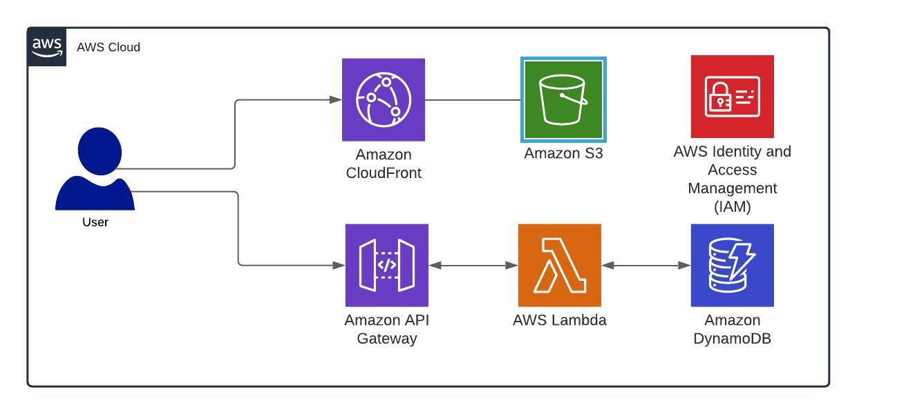

# Getting started with AWS

The ordina aws console:
https://ordina.awsapps.com/start/

Log in with your ordina account and be sure to set the region to **eu-west-1**.

1. Create s3 bucket
    - Name it "YOUR_NAME-aws-workshop-frontend" with **your name** as the prefix.
    - Unblock all public access so the bucket is publicly available.
    - Go to your bucket and edit the permissions. Add the following policy.
    ```json
    {
    "Version": "2012-10-17",
    "Statement": [
        {
        "Sid": "PublicReadGetObject",
        "Principal": "*",
        "Action": [
            "s3:GetObject"
        ],
        "Effect": "Allow",
        "Resource": [
            "arn:aws:s3:::YOUR_NAME-aws-workshop-frontend",
            "arn:aws:s3:::YOUR_NAME-aws-workshop-frontend/*"
        ]
        }
    ]
    }
    ```

    - Enable **Static website hosting** in the properties with *index.html* as the **Index document**.

2. Create coudfront distribution (takes a while, 25min)
    - Select the frontend s3 bucket as the origin domain. The other defaults are fine.

3. Create dynamodb table
    - Name it "YOUR_NAME-aws-workshop-jokes" with **your name** as the prefix.
    - Partition key is your primary key, so it should be the id. Keep the rest default or empty.
    - After the table is created go to your table and **view items**. Then **create item**, and start cracking some jokes. Be sure to use the following attributes: id, joke, vote (all lowercase). The vote attribute should be "EMPTY" for every joke.

4. Create 2 lambdas
    - Paste the code from the lambda folder to the corresponding lambda and **DEPLOY**.
    - In the configuration tab we add an environment variable **TABLE_NAME** with the name of your previously created table.

5. Give lambdas permission to read from the table (steps for both lambdas)
    - During the creation of the lambda aws also created an **Execution role** and attached it to the lambda. We can find the role through the lambda interface. (Your lambda > Configuration tab > permissions)
    - Add this statement to the existing policy. Replace TABLE_ARN with your table arn. (Your table > Overview > Additional info)
    ```json
    {
      "Statement": [
        ...
        {
          "Effect": "Allow",
          "Action": [
              "dynamodb:Query",
              "dynamodb:GetItem",
              "dynamodb:PutItem",
              "dynamodb:UpdateItem",
              "dynamodb:Scan"
          ],
          "Resource": "TABLE_ARN"
        }
      ]
    }
    ```

6. create an api-gateway (REST API)
    - It should have 2 resources "get" and "vote". Don't forget to enable CORS!
    - Add a get method to the get resource, and a post resource to the vote resource
    - Attach the lambdas

7. Deploy the API (actions > Deploy API)
    - Create a new stage: "jokes"

8. compile frontend and add files to s3 frontend bucket
    - Set REACT_APP_BACKEND variable inside the *frontend/.env* file with the **Invoke URL** from the api gateway.
    - *npm install* inside the frontend folder
    - *npm run build* inside the frontend folder

## Cleanup
clean up the following resources:
- the s3 frontend bucket (delete all files first)
- the cloudfront distribution
- the dynamodb table
- both lambdas (will automatically delete the policies attached to them)
- the api gateway